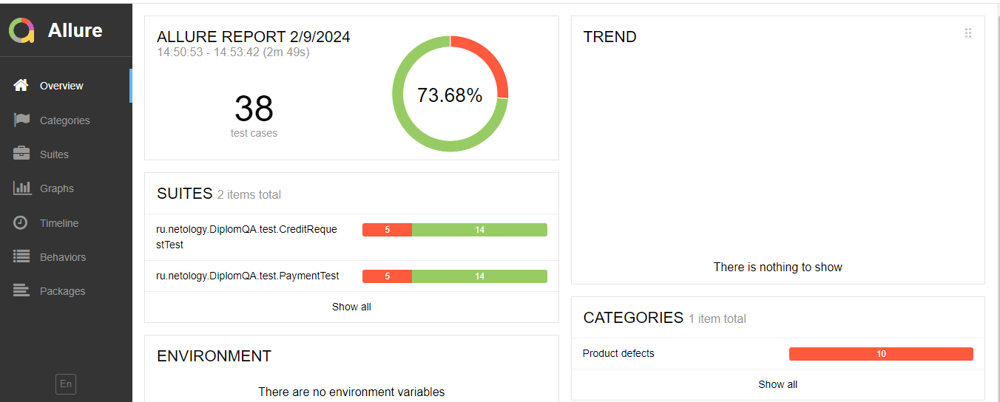

### Отчет по итогам тестирования
В ходе выполнения дипломной работы было проведено автоматизированное тестирование веб-сервиса "Путешествие дня",
которое представляет собой комплексный сервис, взаимодействующий с СУБД и API Банка.

#### В ходе тестирования были проверены процессы:

- работа формы для обоих способов оплаты (по дебетовой карте и в кредит) через веб-браузер Google Chrome;
- взаимодействие приложения с банковскими сервисами;
- сохранение информации в СУБД (MySQL и PostgreSQL).

#### Общее количество тест-кейсов - 38 (4 позитивных, 34 негативных), повторяющихся для обеих СУБД:
* успешных - 28 (73,68%)
* неуспешных - 10 (26,32%)

#### Общие рекомендации
1. Устранить [баги](https://github.com/luksiria/DiplomQA/issues);
2. Добавить уникальные идентификаторы для элементов страниц (test-id) для упрощения
   автоматизации тестирования;
3. Составить документацию к приложению.
